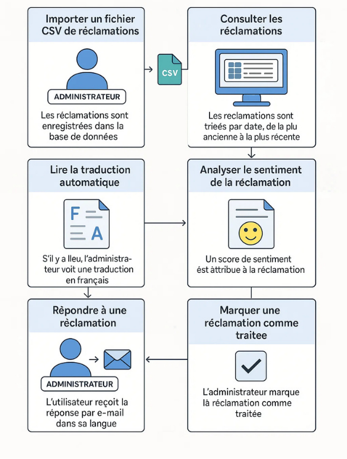
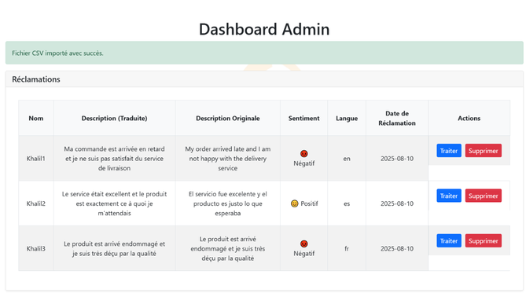
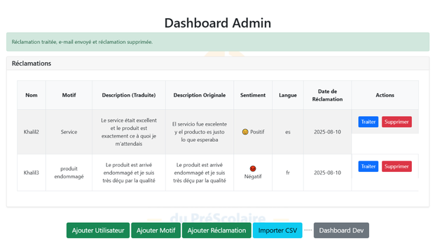
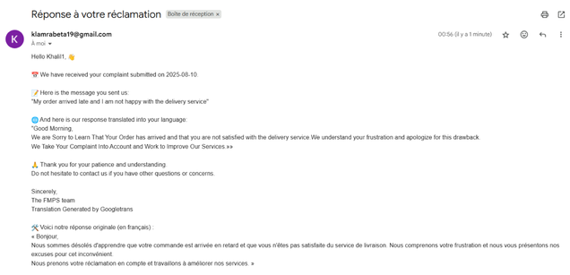

# AI-Powered Complaint Management System

A web-based CRM application built with **Python, Flask, and SQLite** to manage customer complaints, analyze sentiment, translate messages, and streamline customer support workflows.

## Overview

This project was developed to simplify complaint management by combining traditional CRM functionality with AI-powered text analysis and automation.

The application enables administrators to centralize customer complaints, understand the sentiment expressed in messages, translate incoming requests, and send email responses from a unified interface.

It also supports CSV data import to facilitate the integration of complaint records.

## Key Features

* **Complaint Management:** Centralize and manage customer complaints through a web interface.
* **Sentiment Analysis:** Analyze the emotional tone of complaint messages to help identify customer dissatisfaction and prioritize requests.
* **Automatic Translation:** Translate complaint messages to facilitate communication across different languages.
* **Email Response Automation:** Send email replies to customers directly from the application.
* **CSV Import:** Import complaint records from CSV files for streamlined data entry.
* **Persistent Data Storage:** Store and manage complaint data using SQLite.

## Tech Stack

| Category    | Technologies                              |
| ----------- | ----------------------------------------- |
| Backend     | Python, Flask                             |
| Database    | SQLite                                    |
| Frontend    | HTML, CSS, JavaScript                     |
| AI / NLP    | Sentiment Analysis, Automatic Translation |
| Data Import | CSV                                       |

## Architecture

The application follows a lightweight web application architecture:

```text
                 User / Administrator
                          |
                          v
                  Web Interface
                          |
                          v
                    Flask Backend
                          |
            +-------------+-------------+
            |             |             |
            v             v             v
       Complaint      AI / NLP       Email
       Management     Processing     Service
            |             |             |
            +-------------+-------------+
                          |
                          v
                       SQLite
```
## WORKFLOW of the project




## Dashboard/TESTING



 

## Reclamations



 
## RESULTAT FINAL 




The Flask backend handles application logic, while SQLite provides persistent storage for complaint records.

## Main Workflows

### 1. Complaint Management

Administrators can manage customer complaints through the application, providing a centralized way to track incoming requests.

### 2. Sentiment Analysis

Complaint messages are processed using sentiment analysis to identify their emotional tone. This information can help support teams better understand customer feedback.

### 3. Automatic Translation

Incoming messages can be translated to make complaints easier to understand when they are written in different languages.

### 4. Email Responses

The application supports sending email replies to customers, helping streamline communication and reduce repetitive manual work.

### 5. CSV Import

Complaint records can be imported from CSV files, making it easier to populate the application with existing data.

## Getting Started

### Prerequisites

* Python 3.x
* pip
* Git

### 1. Clone the repository

```bash
git clone https://github.com/Xerow42/crm.git
cd crm
```

### 2. Create a virtual environment

**Windows:**

```bash
python -m venv .venv
.venv\Scripts\activate
```

**Linux / macOS:**

```bash
python3 -m venv .venv
source .venv/bin/activate
```

### 3. Install dependencies

If the repository contains a `requirements.txt` file:

```bash
pip install -r requirements.txt
```

Otherwise, install the dependencies listed in the project configuration.

### 4. Configure environment variables

If the application uses environment variables for email credentials or other configuration, create a local `.env` file based on the project's configuration.

**Never commit passwords, API keys, or email credentials to GitHub.**

### 5. Run the application

Use the Flask entry point configured in the repository. For example, if the application entry point is `app.py`:

```bash
python app.py
```

Alternatively, if the project is configured for the Flask CLI:

```bash
flask --app app run --debug
```

Open the local URL displayed in the terminal to access the application.

> The exact startup command and environment variables depend on the repository's actual entry point and configuration.

## Project Structure

The application is organized around its Flask backend, database, user interface, and AI-powered processing features.

```text
crm/
├── app.py                 # Flask application entry point (if applicable)
├── templates/             # HTML templates
├── static/                # CSS, JavaScript, and static assets
├── requirements.txt       # Python dependencies (if present)
├── README.md
└── ...
```

The structure above is illustrative. Refer to the actual repository for the complete file layout.

## Skills Demonstrated

* Backend web development with Python and Flask
* Relational data persistence using SQLite
* Natural Language Processing (NLP) and sentiment analysis
* Text translation and automation
* CSV data processing
* Email integration
* Full-stack application development

## Future Improvements

Potential enhancements include:

* Complaint prioritization based on sentiment and urgency.
* Advanced filtering, search, and analytics dashboards.
* Complaint status tracking and assignment workflows.
* Automated testing and improved error handling.
* Docker-based deployment.
* Role-based access control and enhanced security.

## Author

**Khalil Lamrabet**

Engineering Student — Big Data & Artificial Intelligence

* GitHub: [@Xerow42](https://github.com/Xerow42)
* LinkedIn: [khalillam12](https://www.linkedin.com/in/khalillam12/)
* Email: [klamrabeta19@gmail.com](mailto:klamrabeta19@gmail.com)

---

*Developed as an IT project focused on complaint management, NLP-based text processing*
